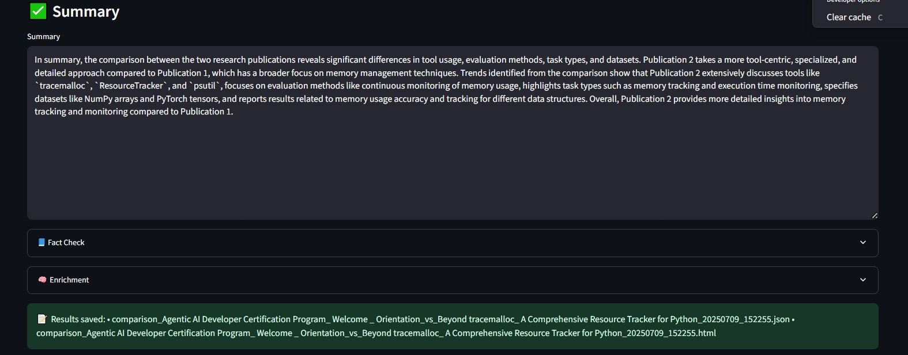

# Agentic AI Developer Certification: LangGraph-Orchestrated Research Assistant for Ready Tensor

This repository is part of the **Agentic AI Developer Certification program** by [Ready Tensor](https://www.readytensor.ai)
and it is linked to the publication:**Agentic AI Developer Certification: LangGraph-Orchestrated Research Assistant for Ready Tensor** on [Ready Tensor](https://www.readytensor.ai)


## Project Description  
This is an AI-powered Streamlit web app that allows users to compare the content of two scientific publications, available in a sample Ready Tensor dataset, side-by-side using natural language queries. Powered by LangChain, LangGraph, and OpenAI APIs, it automates the extraction of key attributes such as tools, datasets, evaluation methods, and results from publications. The system supports visual flowchart generation with Mermaid and Graphviz, handles publication profiling, trend aggregation, fact-checking, and contextual enrichment via external search tools. It follows secure development practices using .env for API keys, includes modular design for testability, and provides Mermaid and Graphviz diagrams for transparent orchestration logic.  

This project is part of the Agentic AI Developer Certification Program, demonstrating the use of agent-based workflows for real-world tasks such as document comparison, summarization, fact-checking and enrichment to be used by Ready Tensor Users, Developers/Engineers and Enterprises/Institutions.


## Features  
Streamlit UI for selecting publications and comparison queries

Agent-powered orchestration using LangGraph or similar tools

Support for predefined and custom queries like "Tool Usage", "Datasets", or "Evaluation Methods"

Structured results including:

- Summary of differences

- Fact-checking content

- Enrichment using AI agents

- Export to HTML and JSON for easy sharing or downstream processing

- Environment-driven setup with .env for secure API key management 


**Data Processing**    

- _Publication Loader_: Unified loader for `.json` datasets of scientific publications  
- _Publication Export_: Extracts and saves each publication as an individual `.txt` file  
- _Preprocessing_: Cleans titles for filenames and preserves structured content  
- _Secure Data Paths_: Centralized project path resolution for compatibility across environments  

**Analysis Pipeline**  

- _LangGraph Orchestration_: Modular, state-driven processing using LangGraph  / Agent-powered orchestration using LangGraph or similar tools  
- _Profile Extraction_: Uses GPT to extract key attributes (tools, datasets, metrics, tasks, results)  
- _Comparison Engine_: Performs side-by-side analysis aligned with user queries  
- _Trend Aggregation_: Identifies evolving patterns in methods and findings  
- _Fact-Checking Node_: Validates all generated insights against original publications  
- _ReAct Enrichment_: Integrates external context via Tavily web search for deeper comparisons  

**Visualization & Security**  

- _Interactive Streamlit UI_: User-friendly interface for selecting, querying, and comparing publications  / Streamlit UI for selecting publications and comparison queries  
- _Flowchart Generation_: Outputs workflow diagrams using `Graphviz` and `Mermaid` syntax  
- _Mermaid Export_: Saves `.mmd` files for rendering in docs or CI pipelines  
- _Graphviz Export_: Saves PNG diagrams of orchestration pipelines in docs/  
- _Environment Safety_: Uses `.env` for API keys and provides a safe .env_example for sharing  / Environment-driven setup with .env for secure API key management 
- _Git Hygiene_: Preconfigured `.gitignore` to protect secrets and generated files  


## Repository Structure  
```
Agentic_AI_Developer_Certification_Project2/
├── app.py                    # Main Streamlit app UI (entry point for the web interface)
├── utils.py                  # Helper functions for path and string handling
├── explorer.py               # Core logic for publication analysis using LangGraph and LLMs
├── .env.example              # Example environment file storing secret API keys
├── data/                     
│   └──project_1_publications.json   # Sample Ready Tensor dataset
│   └──sample_publications/      # Directory containing input publication `.txt` files
│      └── <publication .txt>    #     ↳ Each text file represents a single publication
├── requirements.txt          # Dependency list for pip install (Streamlit, LangChain, etc.)
├── README.md          	      # This file contains the documentation for the project, explaining how to set it up and use it.
├── .gitignore        	      # This file specifies the files and folders that should be ignored by Git.   TO BE ENCLOSED 
├── LICENCE    	            # This file contains the license for the project.
├── outputs/    	            # 
│   └── <comparison publ1 vs publ2 .html>       #     ↳ Each text file represents the output of the comparison publ1 vs publ2 in htlm
│   └── <comparison publ1 vs publ2 .json>       #     ↳ Each text file represents the output of the comparison publ1 vs publ2 in json
├── loader.py                 # Converts JSON into individual .txt files from the Sample Ready Tensor dataset
├── paths.py                  # Centralized path definitions
├── generate_graphviz_flowchart.py   # Generates a Graphviz PNG diagram of the LangGraph orchestration flow
├── generate_langgraph_mermaid.py   # Generates a Mermaid diagram of the LangGraph orchestration flow
├── docs/
│   └── publication_flowchart.png    # output image file Graphiz
│   └── langgraph_flowchart.mmd      # output file Mermaid diagram (flowchart)
│   └── Untitled diagram _ Mermaid Chart-2025-07-09-115351.png    # output Mermaid diagram (flowchart) in png
├── examples_screens   #
│      └── <screenshot .jpeg>    #     ↳ Each jpeg file represents a section of screenshot of example usage of the StreamLit interface 

```
 >_Note_ This repository includes a well-configured `.gitignore` file to keep your repository clean by preventing large, sensitive, or autogenerated files from being committed (by ignoring outputs, environment files, and temporary files).

## Prerequisites
* Python 3.10+
* An OpenAI API key and a Tavily API key (OPENAI_API_KEY and TAVILY_API_KEY environment variable) 


## Installation
1. **Clone the repo** and be sure you're on the `main` branch:

   ```bash
   git clone https://github.com/micag2025/Agentic_AI_Developer_Certification_Project2
   cd Agentic_AI_Developer_Certification_Project2  
   ```
2. **Install dependencies**   
   Install required packages (preferably in a virtual environment):

   ```bash
   pip install -r requirements.txt
   ```
3. **Create and activate a virtual environment (recommended):**      
   
    ```bash
   python3 -m venv .venv
   source .venv/bin/activate       # Linux / macOS
   .\.venv\Scripts\activate      # Windows
   ```
3. **Set up environment variables**  
   Add your OpenAI API key and TAVILY API key  to a `.env` file in your the project root:

   ```env
   OPENAI_API_KEY=your_openai_api_key_here
   TAVILY_API_KEY= your_tavily_api_key_here
 
   ```
## Running the Application  
1. **Prepare data**    
   Ensure `project_1_publications.json` is present in the data/ directory (or your configured DATA_DIR).
      > _Note:_ The `sample dataset` is available in the "Datasets" section of the related publication.

3. **Launch the App**     
   Run Streamlit from the project root:  
  
   ```
   streamlit run app/main.py
   ```
   
4. **Access the Interface**          
   Open your browser to the local Streamlit URL (usually http://localhost:8501).        

You can now interact with the LangGraph-Orchestrated Research Assistant for Ready Tensor!  


## Usage Examples 

### Streamlit App Example
🖥️ _Launch the UI_
```
streamlit run app.py
```

📘 _Example User Flow_  
1 Select two publications from the dropdowns  
2 Choose a comparison topic (e.g., Evaluation Methods)  
3 Click "Compare"  
4 View the extracted profiles, comparisons, trends, and fact-checking  
5 Optionally, view the LangGraph flowchart in the sidebar or docs  

🔍 _Example: Side-by-Side Comparison_  


📋 Profile Extraction


📈 Trend Analysis


### Flowchart Generation Example
_Generate Mermaid or Graphviz diagrams_
```
python generate_langgraph_mermaid.py
python generate_graphviz_flowchart.py

```
📁 Output:
docs/langgraph_flowchart.mmd
docs/publication_flowchart.png


## License
This project is licensed under the MIT License. See the [LICENSE](LICENSE) file for details.


## Contact Information 
If you encounter bugs, have questions, or would like to request a new feature, please [open an issue](https://github.com/micag2025/Agentic_AI_Developer_Certification_Project2/issues) on this repository.  
Contributions and feedback are welcome!


